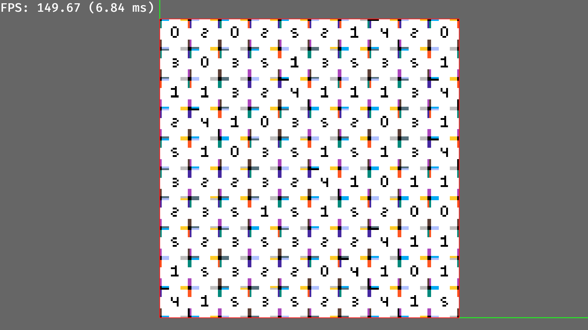

# Bevy EntiTiles 🗺️

A tilemap library for bevy. With many algorithms built in.

This crate is still in need of **optimization and development**. ~~So don't use this in your formal projects.~~ Anyway, I think it's already capable to be a part of your project.

Strongly recommend that you take a look at the [`bevy_ecs_tilemap`](https://github.com/StarArawn/bevy_ecs_tilemap) library first. I took this crate as the reference and learnt the basis of bevy rendering.

This repo is under maintenance as long as this message exists. ( Hope this message can bring you peace of mind. Yeah, that's childish :p )

Notice that the following progress may **not up to date**. Check the `README.md` in `dev` brach to get the latest progress!

## Currently Working On

- Optimize Frustum Culling
- Optimize the data structure of wfc and pathfinding

## Future Goals

- Wave Function Collapse ( Optimization )
- Pathfinding ( Optimization )
- Tilemap-Link
- Runtime Mesh & Texture Baking
- Tilemap Serializing
- SSAO
- Volumetric Clouds / Fog
- Wang Tilling
- Tilemap Mask
- Frustum Culling ( Isometric Specific Optimization )

## Performance

Platform: 10600KF

### Frustum Culling

	
	

> *Bevy 0.11.3, crate 0.1.1, 1000x1000 tiles*

### Pathfinding

The pathfinding algorithm is very fast.

Notice this tests are done with **synchronized pathfinding**. Which means whole algorithm will figure the path out in one frame. But since `0.2.1`, we the supports asynchronized one. The algorithm can complete a part of the pathfinding and continue it in the next frame. This will make it even smoother.

	

| Size      | Time(avg of 3 tests) ms |
| --------- | ----------------------- |
| 100x100   | 12.00                   |
| 500x500   | 295.67                  |
| 1000x1000 | 1384.33                 |

> *Bevy 0.12, crate 0.2.1 (dev), using `pathfinding` example*

### Wave Function Collapse

In the following case, each tile has at least one corresponding color gap with its neighboring tiles

	

Due to the lack of optimization and the straightforward implementation of this algorithm, its execution time increases rapidly as the map size grows. And the likelihood of failure also increases.

| Size  | Time(avg of 3 tests) ms |
| ----- | ----------------------- |
| 5x5   | 3.92                    |
| 10x10 | 33.312                  |
| 20x20 | 490.950                 |
| 30x30 | 2280.121                |
| 50x50 | 18838.542               |

> *Bevy 0.11.3, crate 0.2.0, None weighted*

## Versions

| Bevy ver | EntiTiles ver |
| -------- | ------------- |
| 0.12.x   | 0.2.x         |
| 0.11.x   | 0.1.x         |

