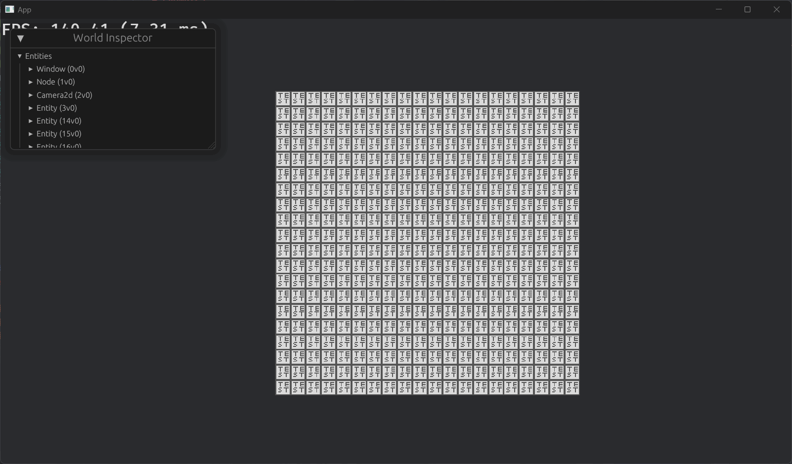

# Bevy EntiTiles 🗺️

A 2d tilemap library for bevy. With many useful algorithms/tools built in.

This repo is under maintenance as long as this message exists. ( Hope this message can bring you peace of mind. Yeah, that's childish :p )

Notice that the following progress may **not up to date**. Check the `SHCHEDULE.md` in `dev` branch to get the most comprehensive progress!

It's **NOT** recommended to use the code in `dev` branch! There's full of incomplete code and even errors! But `master` branch would be ok if you can't wait to try out new features. If you are curious about what will be updated next, you can check the `release_note` in `dev` branch.

## Future Goals

*The higher the priority, the more towards the front in the following list.*

- [LDtk](https://ldtk.io/) Fully Support
- Physics (for LDtk maps)
- Pathfinding (for LDtk maps)
- Wave Function Collapse ( Collapse map from LDtk; Optimization )
- Chunk Unloading
- Infinite Tilemap
- Runtime Mesh & Texture Baking
- Tilemap-Link
- Wang Tilling
- Tilemap Mask
- [Tiled](https://www.mapeditor.org/) Support
- Volumetric Clouds / Fog
- SSAO
- Lighting
- Realtime Shadow
- ~~Frustum Culling~~

## Known Issues

*Versions in the end of the line means when the issue will be fixed. `m` means it has already fixed in master branch. Empty if it's not on schedule or the source is unclear.*

- The success probability of the wfc algorithm significantly decreased after switching to `LookupHeap`. ( And that's why I didn't switch to `LookupHeap` )

## Feature Flags

| Flag             | Funtionality                                                                                                            |
| ---------------- | ----------------------------------------------------------------------------------------------------------------------- |
| `algorithm`      | Implementation of algorithms                                                                                            |
| `debug`          | Show some debug info including aabbs for chunks and tilemaps, path finding results etc.                                 |
| `debug-verbose`  | Show verbose process of functions. This feature is only useful when debug algorithms. But it's useless for most of you. |
| `physics_rapier` | Physics support for [`bevy_rapier`](https://github.com/dimforge/bevy_rapier)                                            |
| `physics_xpbd`   | Physics support for [`bevy_xpbd`](https://github.com/Jondolf/bevy_xpbd), like setting colliders etc.                    |
| `serializing`    | Save and load the tilemap from files. Also contains tools for upgrading files.                                          |
| `ui`             | Support renderring tiles as ui image.                                                                                   |

## Coordinate Systems

## Show Cases & Performance

Platform: 10600KF

### Frustum Culling

	
	

> *Bevy 0.11.3, crate 0.1.1, 1000x1000 tiles*

### Animation

	

> *Bevy 0.12.1, crate 0.2.3*

### Ui System

	

### Pathfinding

The pathfinding algorithm is very fast.

Notice this tests are done with **synchronized pathfinding**. Which means whole algorithm will figure the path out in one frame. But since `0.2.1`, the asynchronized one in implemented. So the algorithm can complete a part of the pathfinding and continue it in the next frame. This will make it even smoother.

	

| Size      | Time(avg of 3 tests) ms |
| --------- | ----------------------- |
| 100x100   | 12.00                   |
| 500x500   | 295.67                  |
| 1000x1000 | 1384.33                 |

> *Bevy 0.12, crate 0.2.1, using `pathfinding` example*

### Wave Function Collapse

In the following case, each tile has at least one corresponding color gap with its neighboring tiles.

	

| Size    | Time(avg of 3 tests) ms | Time(avg of 3 tests) ms |
| ------- | ----------------------- | ----------------------- |
| 10x10   | 33.312                  | 16.264 (3)              |
| 20x20   | 490.950                 | 96.009 (3)              |
| 30x30   | 2,280.121               | 335.697 (6)             |
| 50x50   | 18,838.542              | 2,095.428 (8)           |
| 100x100 | (Not measurable)        | 32,309.045 (16)         |

> *Column 1: Bevy 0.11.3, crate 0.2.0, NoneWeighted; Column 2: Bevy 0.12, crate 0.2.1, NoneWeighted, `max_retrace_factor` = number in parentheses*

## Limitations

- Supports up to 1 tilesets in one tilemap. (this will no longer exists in the future)
- Supports up to 4 layers\* in one tilemap.
- Supports up to 32 animations in one tilemap. (this will no longer exists in the future)
- Supports up to 32 length of animation sequences.

*\*The layer here is not the same as you see in LDtk, it's the rendered tilemap layer, which does not include the entity layer*

## Special Thanks & References

- SSAO & Volumetric Clouds / Fog inspired by [this video](https://www.bilibili.com/video/BV1KG411U7uk/).
- [`bevy_ecs_tilemap`](https://github.com/StarArawn/bevy_ecs_tilemap) I took this crate as the reference and learnt the basis of bevy rendering!
- [`bevy_ecs_ldtk`](https://github.com/Trouv/bevy_ecs_ldtk) I was confused and have no idea about how to instantiate LDtk entities before I read this crate! I learnt proc macros and many other things from this crate!

## Versions

| Bevy ver | EntiTiles ver | LDtk ver      |
| -------- | ------------- | ------------- |
| 0.12.x   | 0.2.3         | 1.4.1         |
| 0.12.x   | 0.2.0-0.2.2   | Not supported |
| 0.11.x   | 0.1.x         | Not supported |
