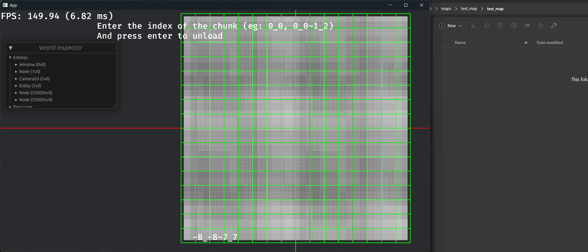
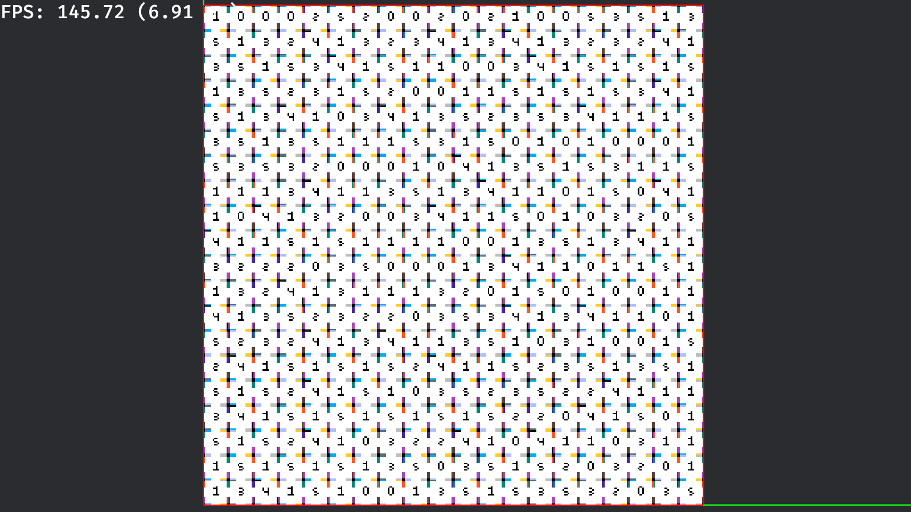

# Examples

| Name                          | Description                                                                                                                                                                                                                                         | Screenshot                            | Required Features (Add this after `--features=`) | Notice                                                                                                                                                                                                                                       |
| ----------------------------- | --------------------------------------------------------------------------------------------------------------------------------------------------------------------------------------------------------------------------------------------------- | ------------------------------------- | ------------------------------------------------ | -------------------------------------------------------------------------------------------------------------------------------------------------------------------------------------------------------------------------------------------- |
| `animation`                   | Introduces the way to use animated tiles on your tilemaps.                                                                                                                                                                                          |        | None                                             | None                                                                                                                                                                                                                                         |
| `basic`                       | Introduces the way to create square/isometric/non-texture tilemaps.                                                                                                                                                                                 |            | None                                             | None                                                                                                                                                                                                                                         |
| `chunk_unloading`             | Introduces the way to detect if the camera is entered/left the chunk, and to load/unload chunks.                                                                                                                                                    |  | `"debug, algorithm, serializing, physics"`       | You need to save the tilemap to your disk first. Please follow the instructions in the file.                                                                                                                                                 |
| `custom_material`             | Introduces the way to use your custom material on the tilemap.                                                                                                                                                                                      |  | None                                             | None                                                                                                                                                                                                                                         |
| `ldtk_wfc`                    | Introduces the way to perform wave function collapse (wfc) algorithm using LDtk levels.                                                                                                                                                             |         | `"algorithm, ldtk, physics"`                     | The screenshot shows the `LdtkWfcMode::MultiMap` mode which requires you to move the little player around using arrow keys. But the actual example is using `LdtkWfcMode::SingleMap` as default so you will see the entire tilemap directly. |
| `ldtk`                        | Introduces the way to load/unload/switching between LDtk levels, and some extra functionalities including automatically generate the `PathTilemap` and `PhysicsTilemap` according to the specific int grid layers, map the `tile_id` to animations. |             | `"debug, ldtk, physics"`                         | You need to rename the LDtk map filename first. Please follow the instructions in the file. You will see nothing until press the number keys. See `load` function for more info.                                                             |
| `pathfinding`                 | Introduces the way to perform asynchronous A* pathfinding on tilemaps.                                                                                                                                                                              |      | `"algorithm, multi-threaded"`                    | None                                                                                                                                                                                                                                         |
| `pathfinding_single_threaded` | Introduces the way to perform synchronous A* pathfinding on tilemaps.                                                                                                                                                                               |      | `"algorithm, multi-threaded"`                    | Almost the same with `pathfinding`, but run this if targeting wasm, or with bevy `multi-threaded` disabled.                                                                                                                                  |
| `physics`                     | Introduces the way to use `PhysicsTilemap` to add colliders to tiles, and the `DataTilemap` which allows you to represent the colliders in an array and `entitiles` will figure out the lease colliders to fill them                                |          | `"physics"`                                      | None                                                                                                                                                                                                                                         |
| `save_and_load`               | Introduces the way to save/load tilemaps from your disk.                                                                                                                                                                                            |    | `"seriaizing, algorithm, physics"`               | Press space to save and right-alt to load.                                                                                                                                                                                                   |
| `tiled`                       | Introduces the way to load/unload/switching beteen Tiled tilemaps. This example is pretty simliar to `ldtk`                                                                                                                                         |            | `"tiled, physics"`                               | Press number keys to switch between tilemaps.                                                                                                                                                                                                |
| `wfc_pattern`                 | Introduces the way to perform wave function collapse (wfc) algorithm using tilemap patterns.                                                                                                                                                        |      | `algorithm, multi-threaded`                      | Youe need to save the patterns to your disk first. Please follow the instructions in the file. Disable `multi-threaded` feature if targeting wasm.                                                                                           |
| `wfc`                         | Introduces the way to perform wave function collapse (wfc) algorithm using single tiles generated according to texture indices.                                                                                                                     |              | `algorithm, multi-threaded`                      | Disable `multi-threaded` feature if targeting wasm.                                                                                                                                                                                          |
